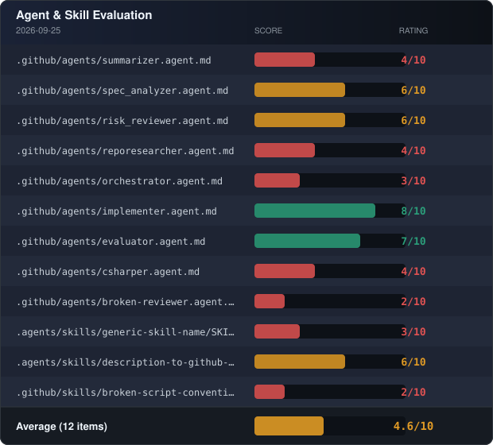

# Agentic Workshop

This repository hosts two workshops for getting more familiar with concepts in agentic workflows and customization.

The first part covers core concepts like creation of custom agents, skills, important aspects like limiting available tools, carefully writing instructions etc.

The second part covers more concepts in how to evaluate and how to orchestrate agents.

## Workshops

### GitHub Copilot Customization 101

Participants learn how to use GitHub Copilot effectively in a real repository by creating custom
skills and agents, shaping their behavior through focused instructions and tool access, and
recognizing when a customization is not working as intended. By the end of the workshop,
participants can diagnose common configuration problems, compare outcomes systematically, choose
models appropriately, and apply practical habits for managing context and token usage.

### Agentic Workflows & Evaluation

Participants learn how to move from individual customizations to reliable agentic workflows that can plan, execute, evaluate, and improve work. They design evaluation approaches for agents and skills, strengthen those evaluations over time, and connect them to CI/CD checks so quality becomes part of the development process. The workshop culminates in orchestrating multiple agents and bringing the pieces together into a repeatable workflow that can be assessed, maintained, and extended.

## Evaluation Status

> The badge is updated by successful runs of the
> [Evaluate Agents & Skills](./.github/workflows/evaluate.yml) workflow.

## Getting Started

### Pre-Exercise Steps

#### Ensuring Setup Success

- [ ] Create your own copy of this workshop using **Use this template**, then select
      **Create a new repository**.
- [ ] Create a `copilot:plan-and-implement` label in the new repository.
- [ ] Invoke the `/description-to-github-issues` skill with GitHub Copilot to turn
      `src/DESCRIPTION.md`, `src/FUNCTIONAL_REQUIREMENTS.md`, and
      `src/TECHNICAL_REQUIREMENTS.md` into workshop issues.
- [ ] In `Settings` → `Actions` → `General`, enable
      **Allow GitHub Actions to create and approve pull requests**, then save.

#### Setting up environments

- [ ] In the repository settings, select `Environments` and create an environment named
      `approval-required`.
- [ ] Configure the `approval-required` environment, enable **Required reviewers**, add yourself as a
      reviewer, and save the protection rules.

#### Familiarizing

- [ ] Check out the repository locally and familiarize yourself with its contents.
- [ ] On GitHub, open an issue and assign the `copilot:plan-and-implement` label to it.
- [ ] Open the `Actions` tab, confirm that the label started a workflow, and follow its progress. The
      workflow can take some time, so you can continue with other tasks and return to review its
      result later.

### Exercises

The exercises are in [GitHub Copilot Customization 101](./exercises/GitHub%20Copilot%20Customization%20101/)
and [Agentic Workflows & Evaluation](./exercises/Agentic%20Workflows%20%26%20Evaluation/).
The workshops are independent; your instructor will tell you which one to use.

Use the
[hosted workshop exercise browser](https://eficodedemoorg.github.io/Agent-Orchestration-and-Evaluation-Workshop/)
for a visual, self-paced interface. For local use, serve the repository over HTTP and open
`/learn/`; see the [workshop exercise browser README](./learn/README.md) for setup details.

## Repository content

The repository includes agent and skill definitions under `.agents/` and `.github/`, plus
additional client configuration under `.claude/`. Some definitions are intentionally weak so the
workshops have realistic examples to diagnose.

Reference documentation lives in the [/docs](/docs/) folder:

- [Copilot customization overview](/docs/copilot-customization.md) — the full landscape (instructions, prompts, agents, skills, MCP) and how the mechanisms combine
- [Agent Skills reference](/docs/skills.md) — SKILL.md anatomy, progressive disclosure, trigger tuning
- [Custom Agents reference](/docs/custom-agents.md) — frontmatter, tool restrictions, handoffs
- [Agent orchestration](/docs/agent-orchestration.md) — the GitHub Actions pipeline that turns labeled issues into ready-for-review PRs

The repository also contains GitHub Actions workflows that orchestrate agents. See
[Agent orchestration](./docs/agent-orchestration.md) for the current pipeline and its guardrails.

The [/evaluator](/evaluator/) tool discovers agent and skill definitions in the supported
`.github/` and `.agents/` locations, evaluates them with AI, and assigns each one a score. It can
also format the results as the badge shown above.

See the [evaluator documentation](./docs/evaluator.md) for usage, arguments, evaluation flow, and badge generation.

The `src/` folder currently contains the description, functional requirements, and technical
requirements for the workshop's example application.
