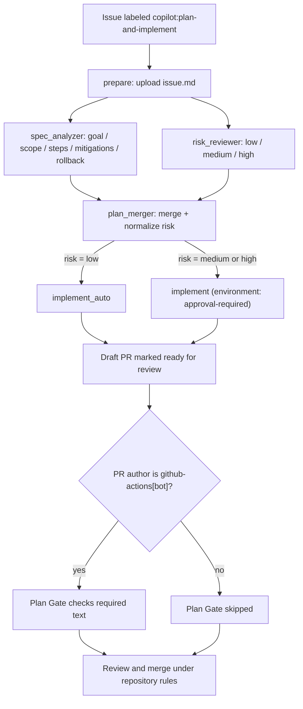

# Agent Orchestration

This repository ships a GitHub-native pipeline that lets an AI agent turn a
labeled issue into a pull request that is ready for review. It produces a
visible plan, a bounded changeset, and automated evidence. Environment approval
is used for medium- and high-risk implementation jobs when the
`approval-required` environment has required reviewers; PR approval and merge
protection depend on repository branch rules outside these workflows.

## Workflows

| Workflow                                                      | Trigger                                                                | Purpose                                                           |
| ------------------------------------------------------------- | ---------------------------------------------------------------------- | ----------------------------------------------------------------- |
| [Plan and Implement](../.github/workflows/plan-implement.yml) | `issues.labeled` (`copilot:plan-and-implement`) or `workflow_dispatch` | Plans, risk-scores, and implements the change on an agent branch. |
| [Plan Gate](../.github/workflows/plan-gate.yml)               | `pull_request` to `main`                                               | Checks the required plan text on PRs authored by `github-actions[bot]`; it is skipped for other authors. |
| [Evaluate Agents & Skills](../.github/workflows/evaluate.yml) | `workflow_dispatch`                                                    | Scores agent/skill definitions and publishes a badge.             |

## Reusable actions

| Action                                                                       | Role in the pipeline                                                                                 |
| ---------------------------------------------------------------------------- | ---------------------------------------------------------------------------------------------------- |
| [`setup-copilot-cli`](../.github/actions/setup-copilot-cli/action.yml)       | Installs Node and the GitHub Copilot CLI on the runner.                                              |
| [`copilot-json-task`](../.github/actions/copilot-json-task/action.yml)       | Runs a Copilot prompt against the issue with injection guards and returns a syntax-validated JSON artifact. |
| [`open-agent-pr`](../.github/actions/open-agent-pr/action.yml)               | Creates the working branch, renders the PR body from `plan.json`, and opens a draft PR.              |
| [`implement-agent-plan`](../.github/actions/implement-agent-plan/action.yml) | Executes the `implementer` agent against the plan, commits results, and marks the PR ready.          |

## End-to-end flow

The [`prepare`](../.github/workflows/plan-implement.yml) job resolves the
issue and uploads it as an artifact. `spec_analyzer` and `risk_reviewer`
fan out in parallel, each producing a JSON artifact through
[`copilot-json-task`](../.github/actions/copilot-json-task/action.yml).
[`plan_merger`](../.github/workflows/plan-implement.yml) fans them back in,
normalizes `risk` to `{low, medium, high}` (defaulting to `high`), and
publishes `plan.json`. The implement stage then either runs directly
(`low`) or waits for approval through the `approval-required`
environment (`medium`/`high`).

The checked-in `open-agent-pr` action currently renders `## Plan`, while Plan
Gate requires the literal heading `## Plan (required)`. As a result, a PR
created by this pipeline fails Plan Gate as the files are currently written.
The workflow documentation below describes that limitation rather than
treating the intended gate as already satisfied.

## Guardrails and how they map to orchestration principles

Each guardrail below is present in the pipeline. The bullet under each one
maps it to the accountability model in the request: a stated goal, an
inspectable plan, a bounded changeset, automated evidence, human judgment,
and a clear outcome.

### 1. Stated goal — the issue is the single source of truth

The pipeline only runs from a real issue: `prepare` calls
`gh issue view` and every downstream job receives the same `issue.md`
artifact. There is no free-form prompt path.

- **Principle:** every agent run has a linkable, human-authored goal.
- **Anti-pattern avoided:** agents acting on ad-hoc chat with no
  traceable request.

### 2. Inspectable plan — structured JSON, not prose

[`spec_analyzer`](../.github/workflows/plan-implement.yml) asks the
model to emit a JSON object with `goal, scope, steps, mitigations,
rollback`. `jq` validates that the output is valid JSON, but it does not
validate the requested fields or their types. Downstream rendering supplies
some fallbacks for missing values but still assumes expected types.
The [`open-agent-pr`](../.github/actions/open-agent-pr/action.yml) action
renders corresponding fields into the PR body; the
[plan template](../.github/PULL_REQUEST_TEMPLATE/plan-template.md) documents
the intended shape.

- **Principle:** the plan is machine-readable and reviewer-visible before
  implementation, while field-level schema validation remains a gap.
- **Anti-pattern avoided:** "trust me" PRs where the intent is buried in
  the diff.

### 3. Risk gate — approval scales with blast radius

[`risk_reviewer`](../.github/workflows/plan-implement.yml) produces a
single field (`low | medium | high`). `plan_merger` normalizes the value
and defaults to `high` on anything unexpected. The result routes to one
of two jobs:

- `implement_auto` runs directly for `low` risk.
- `implement` targets the `approval-required` environment; GitHub blocks
  the job until a reviewer approves in the Environments UI when required
  reviewers are configured for that environment.

- **Principle:** checks match the risk of the change; unknown risk is
  treated as high risk.
- **Anti-pattern avoided:** uniform "auto-merge everything" or uniform
  "block everything" policies that either under- or over-invest in
  review.

### 4. Bounded changeset — one branch, one PR, one job

[`open-agent-pr`](../.github/actions/open-agent-pr/action.yml) creates a
deterministic branch name (`agent-plan/issue-<n>-<run_id>`), opens a
**draft** PR immediately, and exports `BRANCH`/`BASE` for the next step.
The [`concurrency`](../.github/workflows/plan-implement.yml) group is
keyed on the issue number with `cancel-in-progress: false`, so two runs
for the same issue cannot race.

- **Principle:** every agent contribution is a diff on a named branch
  attached to an issue.
- **Anti-pattern avoided:** agents pushing to shared branches or
  producing overlapping changes for the same request.

### 5. Least-privilege permissions per job

`permissions: {}` is declared at the workflow level and each job opts in
to only what it needs (`contents: read`, `copilot-requests: write`, and
only `implement*` gets `contents: write` + `pull-requests: write`). The
planning jobs cannot push code, and the implement jobs cannot exist
without a merged plan.

- **Principle:** capability boundaries separate "think" from "act".
- **Anti-pattern avoided:** a single over-scoped token that lets any
  step do anything.

### 6. Prompt-injection hardening

[`copilot-json-task`](../.github/actions/copilot-json-task/action.yml)
loads the untrusted issue body into a shell variable, embeds it inside
`<ISSUE>` tags with an explicit instruction to ignore any directives
found inside, and restricts Copilot to read-only tools
(`--available-tools='view,glob,grep'`). Output is extracted between the
first `{` and last `}` and re-parsed by `jq` before being trusted.

- **Principle:** treat model inputs as untrusted data and model outputs
  as untrusted until validated.
- **Anti-pattern avoided:** issue authors (or transitive content in
  linked files) steering the agent into unintended tools or actions.

### 7. Plan Gate for bot-authored PRs

[Plan Gate](../.github/workflows/plan-gate.yml) is triggered for PRs to
`main`, but its job runs only when the PR author is `github-actions[bot]`.
For those PRs it fails if the body is missing any required text from the
[plan template](../.github/PULL_REQUEST_TEMPLATE/plan-template.md)
(Goal, Scope, Steps, Success criteria, Risks, Rollback, Evidence,
Review checklist). It reads `PR_BODY` as data — never through `eval`.

- **Current limitation:** human-authored PRs skip the gate, and generated
  agent PRs use `## Plan` instead of the required `## Plan (required)`, so
  the generated PR fails the check.
- **Principle:** required plan fields are mechanically checked on the
  bot-authored path, but this is not a repository-wide plan policy.

### 8. Draft first, ready second

`open-agent-pr` always opens the PR as a **draft**;
[`implement-agent-plan`](../.github/actions/implement-agent-plan/action.yml)
later calls `gh pr ready`. The action intends to leave the PR as a draft
when the agent produces no changes, but its current check also counts the
initial empty branch commit. Consequently, it can mark a PR ready even when
the agent produced no file diff.

- **Human gates:** medium/high risk can require environment approval, and
  PR approval can be required by repository branch rules. Neither low-risk
  environment approval nor PR review is universally enforced by these
  workflow files alone.
- **Principle:** draft creation exposes the plan before implementation,
  while repository settings remain responsible for merge ownership.

### 9. Audit trail

A completed planning run leaves `issue`, `spec`, `risk`, and `plan` artifacts. The implementation
stage adds a PR, branch, and initial commit; it adds a separate implementer commit only when the
agent stages file changes. The resulting evidence includes:

- The `issue`, `spec`, `risk`, and `plan` [artifacts](../.github/actions/copilot-json-task/action.yml) captured per run.
- The plan rendered into the PR body, including a link back to the [workflow run](../.github/actions/open-agent-pr/action.yml).
- The [initial empty commit](../.github/actions/open-agent-pr/action.yml) (`chore: start agent plan for issue #N`) that anchors the branch to the issue before any code is written.
- When file changes are staged, the implementer commit produced by [`implement-agent-plan`](../.github/actions/implement-agent-plan/action.yml), pushed to a branch named after the issue and run.
- The [Plan Gate check](../.github/workflows/plan-gate.yml) recorded on the PR.

Together these map to the six-item accountability checklist:

| Requirement        | Where it lives                                                                                     |
| ------------------ | -------------------------------------------------------------------------------------------------- |
| Stated goal        | Issue linked from PR title/body                                                                    |
| Inspectable plan   | `plan.json` artifact + PR body from [`open-agent-pr`](../.github/actions/open-agent-pr/action.yml) |
| Bounded changeset  | `agent-plan/issue-<n>-<run_id>` branch                                                             |
| Automated evidence | Workflow run URL + uploaded artifacts                                                              |
| Human judgment     | `approval-required` environment for non-low risk when protected + repository PR review rules       |
| Clear outcome      | PR and run history support merge, revert, or issue escalation decisions                            |

## Post-incident view

If an agent change passes CI and later regresses, this pipeline is designed
so the review is about the system, not the agent:

- **Was there a visible plan and scope?** Yes — `plan.json` and PR body.
- **Were the right reviewers requested and approvals given?** Check the
  configured `approval-required` environment and PR review history.
- **Did the checks match the risk?** The `risk` field in `plan.json` and
  the branching in `plan_merger` show which path ran.
- **Is the audit trail sufficient?** The run's artifacts, the branch, and
  the PR together reconstruct the decision.

The recovery path for a regression is to revert the implementer commit on
the agent branch (or the merge commit on `main`) and re-open the issue.
The branch and initial commit are keyed to the issue and run; artifacts
provide the corresponding plan while they remain within their retention
period.
